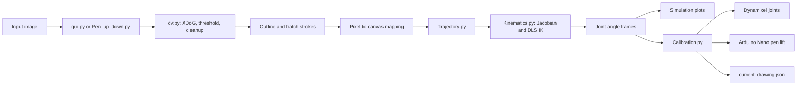

# Bob Ross without ROS

Bob Ross without ROS is an image-to-drawing pipeline for a three-link, planar (3-DoF) robotic arm. It converts an image into outline and hatch strokes, maps them into a physical canvas workspace, solves inverse kinematics (IK), produces joint-limited trajectories, and can command Dynamixel servos. Tkinter/Matplotlib interfaces support previewing and simulating drawings.

The project goal is to reproduce two-dimensional image contours with geometrically accurate paths, smooth joint motion, and practical safety checks for the physical arm.

> **Safety:** `BobRoss/Calibration.py` enables servo torque and can move a real arm. Clear the workspace, verify serial devices, joint directions, and limits, and be ready to remove power. Use simulation and low-risk manual moves before a full draw.

## Table of contents

- [Capabilities](#capabilities)
- [Repository map](#repository-map)
- [System workflow](#system-workflow)
- [Prerequisites and installation](#prerequisites-and-installation)
- [How to run](#how-to-run)
- [Common use cases](#common-use-cases)
- [Configuration reference](#configuration-reference)
- [Code file reference](#code-file-reference)
- [Debugging and testing](#debugging-and-testing)
- [Best practices](#best-practices)
- [Current limitations](#current-limitations)

## Capabilities

- Converts PNG/JPG/JPEG input (and BMP in the legacy simulator) to drawing paths.
- Uses bilateral filtering, XDoG, Otsu thresholding, component cleanup, contour simplification, B-spline smoothing, and hatch generation.
- Maps image paths to a centimetre-based canvas, solves damped-least-squares IK, and constrains trajectories by configured joint velocity and acceleration limits.
- Displays previews, arm motion, pen state, and joint velocities.
- Supports a serial Arduino Nano pen-lift controller, Dynamixel Protocol 2.0 servo control, stall detection, and stroke-level recovery logging.

## Repository map

```text
.
├── painting-arm                  # Standalone/legacy image-to-simulation program
├── BobRoss/
│   ├── Calibration.py            # Interactive hardware calibration and drawing runner
│   ├── Configurations.py         # Shared arm, motion, vision, and canvas constants
│   ├── Kinematics.py             # FK, Jacobian, and DLS IK
│   ├── Trajectory.py             # Continuous joint-limited trajectory planner
│   ├── cv.py                     # XDoG image-to-robot-path pipeline
│   ├── gui.py                    # Path-selection GUI used by the hardware runner
│   ├── Pen_up_down.py            # Integrated simulator and Nano pen controller
│   └── logs/current_drawing.json # Runtime recovery state
├── GradientDescentBasedIK.pdf    # IK reference material
├── .vscode/settings.json         # VS Code Python environment preference
└── README.md
```

`BobRoss/` is the integrated vision, planning, simulation, and hardware path. `Arm_drawing` is a separate, self-contained simulator with different geometry, limits, image processing, and trajectory code; it is not used by the hardware runner.

## System workflow



1. A user loads an image in `gui.py` (hardware selection) or a simulator.
2. `cv.py` filters the image with XDoG, binarizes and cleans it, extracts and smooths contours, creates hatch paths, then maps pixels into the configured physical canvas.
3. `gui.py` previews paths. When confirmed, `run_gui()` returns mapped strokes to `Calibration.py`.
4. For every stroke, `Calibration.py` raises the pen, moves to the starting coordinate through IK, lowers the pen, and calls `generate_continuous_trajectory()`.
5. `Trajectory.py` steps along the polyline every `DT`, uses the Jacobian pseudo-inverse to translate task-space direction to joint motion, and constrains speed by joint velocity and acceleration limits.
6. `Calibration.py` converts radians to servo ticks, clamps ticks around the measured zero pose, writes goals to the three Dynamixels, and checks encoder movement periodically.
7. It saves paths before drawing and advances the completed-stroke index after every stroke. A detected stall rolls the log back three strokes before safe shutdown.

| Mode | Entry point | Role | Hardware effect |
| --- | --- | --- | --- |
| Path chooser | `python BobRoss/gui.py` | Tune and preview paths. | None |
| Integrated simulator | `Planar3DOFSimApp` launcher below | Modular path/trajectory/velocity simulation. | Nano serial only by default |
| Hardware runner | `python BobRoss/Calibration.py` | Calibrates, draws, and recovers. | Dynamixels and optional Nano |

## Prerequisites and installation

### Hardware

Hardware mode assumes a three-link planar arm, three Dynamixel servos addressed as IDs `0`, `1`, and `2`, a Dynamixel-compatible bus adapter, and optionally an Arduino Nano pen-lift controller. The code labels the joints shoulder (XM540), elbow (XM430), and wrist (XM430); verify actual models and IDs.

Current Linux defaults are `/dev/ttyUSB1` at `1_000_000` baud for Dynamixels and `/dev/ttyUSB0` at `9_600` baud for the Nano. Change these for the actual host (for example, `COMx` on Windows). The Nano firmware must interpret byte `U` as pen-up and `D` as pen-down unless the code is changed.

### Software

- Python 3+ recommended, `pip`, and a desktop session with Tk support.
- For Linux hardware mode, serial-device access permissions.
- No `requirements.txt`, lockfile, `.env`, environment variables, scripts, or automated installer currently exists.

```bash
python -m venv Bob
source Bob/bin/activate                 # Windows PowerShell: Bob\Scripts\Activate.ps1
python -m pip install --upgrade pip
python -m pip install numpy scipy opencv-python matplotlib Pillow pyserial dynamixel-sdk
```

`tkinter`, `json`, `math`, `os`, `sys`, and `time` are standard-library modules; some Linux distributions package Tk separately (for example, `python3-tk`).

## How to run

Run from repository root unless noted. Executing a `BobRoss` script adds its containing directory to Python’s import path, allowing sibling imports.
Connect Ethernet cable between laptop and Raspberry Pi. 
Ensure IPv4 settings for wired connection is set to Link-Local Only in laptop
### Initalising Workflow

```bash
ssh -X rocket@169.254.225.250 
```

Once the dependecies are installed perform this specfic set of commands to make it ready for ssh on Raspi as setup already done in it

### Setting Up the Environment

```bash
tmux new -s Bob         # tmux attach -t Bob (if the session is already made)
```

Try to use and make a tmux session just to be safe so that buffer of raspi doesn't overflow and unexpected stopping of program does not occur.

### Load the dependencies

For running code perfectly without any error we should use the cutom bash file made for it to automatically make everything up for final file to run.

```bash
source BobRoss.sh
```

### Calibrate and draw with hardware

Review serial ports, IDs, inversion flags, relative tick limits, physical link lengths, and canvas mapping first.
Send a picture to the Raspberry PI with the following command in a new terminal

```bash
scp Pictures/picture.jpeg rocket@169.254.225.250:/home/rocket/Desktop/BOB/Bob_Ross/BobRoss/ 
```

then run in SSH
```bash
python3 Calibration.py
```

The script opens the Dynamixel port at startup, switches to extended-position control, asks you to align the entire arm straight along the X axis, records zero ticks, calculates relative safety limits, and enables torque. Upload an image, adjust XDoG and **Hatch Step**, and click **Confirm & Send to Robot**. It previews paths, generates travel/draw trajectories, plots velocities, and uses the Nano if available. Its Dynamixel wrapper import/construction is commented out, so it reports `ARM: SIM-ONLY` by default. It then accepts:

| Command | Action |
| --- | --- |
| `z` | Return joints to calibrated zero. |
| `g` | Prompt for a target `(x, y)` in centimetres and move through IK. |
| `t` | Open the image GUI, save a new session, and draw each confirmed stroke. |
| `r` | Load the recovery log and resume after the saved completed stroke. |
| `q` | Disable torque and exit. |

Use small, supervised `g` moves before `t`. Recovery reuses the stored zero ticks and returns to zero before it continues.

## Common use cases

### Reduce noisy or overly dense paths

Run `python BobRoss/gui.py`, load the portrait, and adjust the XDoG controls. Raise **Hatch Step** to space fill lines farther apart. For persistent small fragments, adjust the contour/component settings in `Configurations.py`, then retest in a simulator.

### Validate the workspace

1. Verify `L1`, `L2`, `L3`, `TARGET_CANVAS_W/H`, and `CANVAS_CENTER_X/Y` against the real arm and paper.
2. Calibrate with `Calibration.py`; use `g` for a few low-risk points.
3. Stop if target, singularity, or safety-clamp warnings appear; correct configuration before drawing.
4. Start with a simple sparse image, not a portrait with dense hatching.

### Recover after a stall/interruption

After a stall, the runner lifts the pen, rolls the log back by `ROLLBACK_STROKES_ON_STALL`, returns to zero, disables torque, and exits. Restore power and mechanical safety, rerun `Calibration.py`, calibrate as requested, then use `r`. Do not recover if the arm, paper, or calibrated reference has moved.

## Configuration reference

### Shared values — `BobRoss/Configurations.py`

| Group | Key values | Effect |
| --- | --- | --- |
| Geometry | `L1=15.9`, `L2=15.05`, `L3=11.1`, `L_TUPLE`, `MAX_REACH` | FK, Jacobian, IK, and reachable workspace. Measure physical links before changing. |
| Limits/timing | `JOINT_LIMITS`, `MAX_LINEAR_SPEED=30.0`, `MAX_JOINT_VEL=4.0`, `MAX_JOINT_ACC=1.5`, `FPS=30`, `DT` | Bounds motion and planner frame time. Conservative values are safer. |
| IK | `IK_MAX_ITER`, `IK_TOL`, `IK_DAMPING`, `IK_MAX_STEP` | DLS convergence and stability near singularities. |
| Trajectory | braking/speed-floor constants, `TRAVEL_SPEED_MULT`, `PAUSE_DURATION` | Braking behavior, minimum movement, travel speed, and pen-change pauses. |
| Filtering | `SG_WINDOW_LENGTH=15`, `SG_POLYORDER=3` | Used by the integrated simulator to smooth long joint trajectories. |
| Vision | `XDOG_*`, contour thresholds, `SPLINE_SMOOTHING`, `APPROX_POLY_EPSILON` | Default vision behavior. `XDOG_AUTO_TUNE` is defined but not read by current code. |
| Canvas | `TARGET_CANVAS_W/H=23.0`, `CANVAS_CENTER_X=26.5`, `CANVAS_CENTER_Y=0.0` | Pixel-to-centimetre workspace mapping. |

### Hardware values

| Location | Verify | Reason |
| --- | --- | --- |
| `Calibration.py` | `DXL_IDs`, `BAUDRATE`, `DEVICENAME`, protocol/control-table addresses | Must match the Dynamixel bus. |
| `Calibration.py` | `JOINT_INVERT`, `REL_LIMIT_1`, `REL_LIMIT_2` | Physical direction and allowed tick travel around measured zero. |
| `Calibration.py` | stall thresholds and rollback count | Balances missed failures against false stall reports. |
| `Pen_up_down.py` | Nano port/baud and `U`/`D` bytes | Must match Arduino connection and firmware. |
| `gui.py` | Slider defaults/ranges | Local GUI defaults; they do not read `Configurations.py`. |
| `Arm_drawing` | Its own geometry, limits, speeds, and mapping | Only changes the legacy simulator. |

## Code file reference

Every executable/code configuration artifact is covered here.

### Root

#### `painting-arm`

### `BobRoss/` planning and vision

#### `BobRoss/Configurations.py`

- **Purpose / usage:** Central constants for arm geometry, limits, timing, vision, filtering, and mapping; imported by `Kinematics.py`, `Trajectory.py`, `cv.py`, `Pen_up_down.py`, and `Calibration.py`.
- **Necessity:** Keeps the modular simulator, planner, and runner on one model; it does not execute motion.
- **Dependencies / dependents:** Imports NumPy; depended on by the five modules above.
- **Key components:** Link tuple/reach, joint and task-space limits, IK values, trajectory shape values, XDoG/contour settings, and canvas mapping constants.
- **Configuration:** Primary calibration location for physical geometry and canvas coordinates. Shared speed/limit changes affect multiple modules.
- **Debugging:** Wrong placement/reach usually starts here. If changing Savitzky–Golay values, retain a viable window length and polynomial order.

#### `BobRoss/Kinematics.py`

- **Purpose / usage:** Planar FK, link positions for rendering, analytical 2×3 Jacobian, damped pseudo-inverse, joint clipping, and iterative DLS IK. Used by `Trajectory.py`, `Pen_up_down.py`, and `Calibration.py`.
- **Necessity:** Converts canvas coordinates into bounded joint poses and exposes the Jacobian needed for trajectory speed limiting.
- **Dependencies / dependents:** Depends on NumPy and shared geometry/IK constants. Depended on by the three modules above; `Arm_drawing` has its own implementation.
- **Key components:** `FK`, `arm_link_positions`, `compute_jacobian`, `damped_pseudo_inverse`, `clip_to_joint_limits`, and `ik_fast_dls`, which returns `(q, success, error_norm)`.
- **Configuration:** Defaults use `L_TUPLE`, limits, and IK settings; FK/link/IK functions accept link tuples and IK accepts iteration/tolerance overrides.
- **Debugging:** Check `success`, error norm, and `FK(q)` before servo commands. Repeated failure points to unreachable mapping, incompatible limits, singularity, or a poor start pose; tune damping/max step rather than bypassing limit clipping.

#### `BobRoss/Trajectory.py`

- **Purpose / usage:** Turns a 2D polyline into one joint-angle vector every `DT`. Called by `Calibration.follow_path()` and `Planar3DOFSimApp` for travel and draw segments.
- **Necessity:** Avoids abrupt waypoint motion by using a shaped Cartesian speed and joint velocity/acceleration constraints.
- **Dependencies / dependents:** Depends on NumPy, configuration motion constants, and kinematics/IK. Depended on by `Calibration.py` and `Pen_up_down.py`.
- **Key components:** `get_interpolated_point`, `_desired_speed`, `_joint_limited_speed_bounds`, and `generate_continuous_trajectory(points, q_start, v_max)`.
- **Configuration:** Caller can override `v_max`; all other limits come from `Configurations.py`.
- **Debugging:** `[]` means fewer than two points; nearly zero path length yields one frame. Inspect frame count, `v_actual`, and `dq_curr` for slow/erratic paths. Overly aggressive limits may outrun hardware.

#### `BobRoss/cv.py`

- **Purpose / usage:** Reusable image-to-path pipeline. `gui.py` uses its stages for previews; `Pen_up_down.py` calls `image_to_robot_paths()`; `Calibration.py` imports it.
- **Necessity:** Converts raster images to scaled physical polylines, retaining hatch metadata in `AnnotatedPath.is_hatch`.
- **Dependencies / dependents:** NumPy, OpenCV, SciPy interpolation, and vision/canvas constants; used by `gui.py`, `Pen_up_down.py`, and `Calibration.py`.
- **Key components:** `xdog_filter`, `automatic_parameters`, `remove_small_components`, `preprocess_image`, `extract_smoothed_contours`, `generate_hatching_paths`, `map_paths_to_workspace`, and `image_to_robot_paths`.
- **Configuration:** Pass XDoG values per image or change shared thresholds/mapping. Hatch spacing is `step=4` pixels by default.
- **Debugging:** Inspect the binary result if output is empty; component cleanup can remove small details. Tune spline/approximation for jagged contours. Correct placement in `map_paths_to_workspace`, not IK.

#### `BobRoss/gui.py`

- **Purpose / usage:** Compact Tkinter/Pillow image selector. It previews outlines/hatches and returns mapped paths from `run_gui()`; `Calibration.py` launches it for `t`.
- **Necessity:** Provides an operator approval point before a new hardware session is saved and drawn.
- **Dependencies / dependents:** Tkinter, OpenCV, Pillow, NumPy, and `cv.py` path functions. Depended on by `Calibration.py`; it also runs standalone.
- **Key components:** `XDoGGUI.load_image`, `update_preview`, `confirm`, and `run_gui`.
- **Configuration:** Local slider defaults/ranges plus shared physical mapping through `cv.map_paths_to_workspace`.
- **Debugging:** Closing without confirmation leaves `cv_paths=None`. Blank preview can be an unreadable file or aggressive preprocessing. Use a graphical session and check `cv2.imread`/the binary sketch.

### `BobRoss/` simulation and hardware

#### `BobRoss/Pen_up_down.py`

- **Purpose / usage:** Defines the integrated simulator and Arduino Nano pen serial interface. `Calibration.py` imports `NanoPenController`; users can launch `Planar3DOFSimApp` with the command above.
- **Necessity:** Shows planned motion/velocities and synchronizes pen-state changes to trajectory segments. Nano failure degrades to sim-only operation.
- **Dependencies / dependents:** Tkinter, NumPy, Matplotlib, OpenCV, SciPy signal processing, PySerial, configurations, kinematics, trajectory, and CV modules. Depended on by `Calibration.py`.
- **Key components:** `NanoPenController` opens serial and writes `U`/`D`; `Planar3DOFSimApp` previews, plans travel/draw states, smooths eligible segments with Savitzky–Golay, animates, and safely closes connections.
- **Configuration:** Nano path/baud in the app constructor; trajectory/filter/vision values come from `Configurations.py`. Dynamixel wrapper code is commented out and no wrapper file exists.
- **Debugging:** Serial errors are printed and leave pen sim-only; check device/permissions/firmware. Use `run_animation_loop` to inspect index, pen state, frames, and synchronization. Smoothing is skipped when a segment is not longer than `SG_WINDOW_LENGTH`.

#### `BobRoss/Calibration.py`

- **Purpose / usage:** Executable real-robot runner: calibrates ticks, configures Dynamixels, converts radians to ticks, draws strokes, detects stalls, and persists/resumes sessions.
- **Necessity:** The hardware bridge with tick clamping and recovery; this is the principal deployment entry point.
- **Dependencies / dependents:** Standard library, NumPy, `dynamixel_sdk`, trajectory/config/kinematics, `Pen_up_down.py`, `cv.py`, and `gui.py`. No file imports it. Treat it as a script: importing opens the port and starts calibration/command loop.
- **Key components:** Signed tick read/write; torque/mode helpers; `go_to_xy_3dof` and `follow_path`; `check_for_stall` and `ArmStallError`; session save/load/update/rollback; commands `z`, `g`, `t`, `r`, `q`.
- **Configuration:** Verify all top-level bus constants, IDs, device path, inversion, relative limits, and stall thresholds. It reads shared `MAX_LINEAR_SPEED` and `FPS`, then derives absolute tick limits from measured zero.
- **Debugging:** Port/baud failure exits near startup. Wrong direction: stop and correct `JOINT_INVERT`; unexpected clamp: inspect printed limits and `REL_LIMIT_*`. A stall means command changed but encoder motion did not; inspect power, cabling, binding, IDs, and thresholds. The broad handler homes/disables torque—preserve console output and inspect the log.

### Runtime and editor files

#### `BobRoss/logs/current_drawing.json`

- **Purpose / usage:** Runtime stroke-recovery data. `Calibration.py` overwrites it before a draw, advances it after each stroke, and reads/rolls it back for recovery.
- **Necessity:** It is the persistent state for `r`. The committed file is empty, so recovery is unavailable until a session begins.
- **Dependencies / dependents:** JSON-only; written and consumed only by `Calibration.py`.
- **Key fields / configuration:** Valid data contains `zero_ticks`, `strokes`, and `last_completed_stroke`; do not edit while active.
- **Debugging:** Empty or malformed JSON raises `JSONDecodeError` in the current recovery path. Discard or repair it only while idle and only when intentionally abandoning recovery.

`GradientDescentBasedIK.pdf` is reference documentation rather than code. The active runnable IK is the damped-least-squares implementation in `BobRoss/Kinematics.py`.

## Debugging and testing

### Safe initial checks

```bash
# Syntax-check source without running Calibration.py's hardware startup.
python -m py_compile BobRoss/Calibration.py BobRoss/Configurations.py \
  BobRoss/Kinematics.py BobRoss/Pen_up_down.py BobRoss/Trajectory.py \
  BobRoss/cv.py BobRoss/gui.py
```

There is no committed test suite or CI. New tests should target pure functions in `cv.py`, `Kinematics.py`, and `Trajectory.py`; mock Dynamixel/serial calls instead of using live hardware.

| Symptom | Likely cause | Resolution |
| --- | --- | --- |
| Import error | Package absent from selected interpreter. | Activate `.venv`, install listed packages, check VS Code interpreter. |
| `TclError` / no GUI | Headless machine or missing Tk. | Use a desktop display/backend and install Tk support Or sun command with -X tag to open preview on PC itself(raspi desktop screening). |
| Port/baud startup failure | Bad device path, permissions, power, cable, or baud. | Verify enumeration, permissions, power, and `DEVICENAME`/`BAUDRATE`. |
| Pen reports sim-only | Wrong Nano device, firmware, or permissions. | Check Nano port/baud and `U`/`D` protocol. |
| Arm moves opposite direction | Bad inversion, zero, or mounting assumption. | Remove power, correct `JOINT_INVERT`, recalibrate, use a small supervised `g`. |
| Target warning or bad placement | Mapping, geometry, limits, or singularity. | Validate geometry/canvas values and test individual points. |
| Empty/noisy paths | Input or CV settings. | Inspect preview/binary image; tune XDoG, hatch step, component and contour thresholds. |
| Recovery fails | No valid session or unsafe repositioning. | Start a new session or repair JSON only while idle; resume only with a trusted setup. |

Useful breakpoints/log points: `cv.py` (`binary_image`, path counts, mapped paths), `ik_fast_dls` (success/error/FK result), `generate_continuous_trajectory` (frame count, `v_actual`, `dq_curr`), and `Calibration.py` console output/log JSON (zeros, clamps, strokes, stalls).

## Best practices

1. Treat link geometry, canvas mapping, joint limits, inversion flags, and tick limits as one calibration set.
2. Develop without hardware first using the legacy or integrated simulator and the path-preview GUI.
3. Begin hardware work with sparse/high-contrast images and small supervised `g` moves.
4. Keep speed and acceleration conservative until physical performance is verified; never rely solely on software limits as an e-stop.
5. Keep the pen lifted during travel/errors and verify the Nano mechanical action.
6. Add numerical/image tests before changing IK or planner tuning; assert that planned points remain reachable and within limits.
7. Do not import `Calibration.py` as a library: import triggers port opening, calibration, and an interactive loop.
8. A production-quality next step is an entry-point guard around the hardware runner, pinned dependencies, Arduino/wiring/CAD artifacts, and tests/CI.

## Current limitations

- No package installer, requirements lockfile, automated tests, or CI.
- No Arduino firmware, wiring diagram, BOM, CAD, or active Dynamixel wrapper for the integrated simulator is committed.
- `Calibration.py` is Linux-device-name specific and executes hardware setup at import time.
- `gui.py` slider defaults are local rather than sourced from `Configurations.py`.
